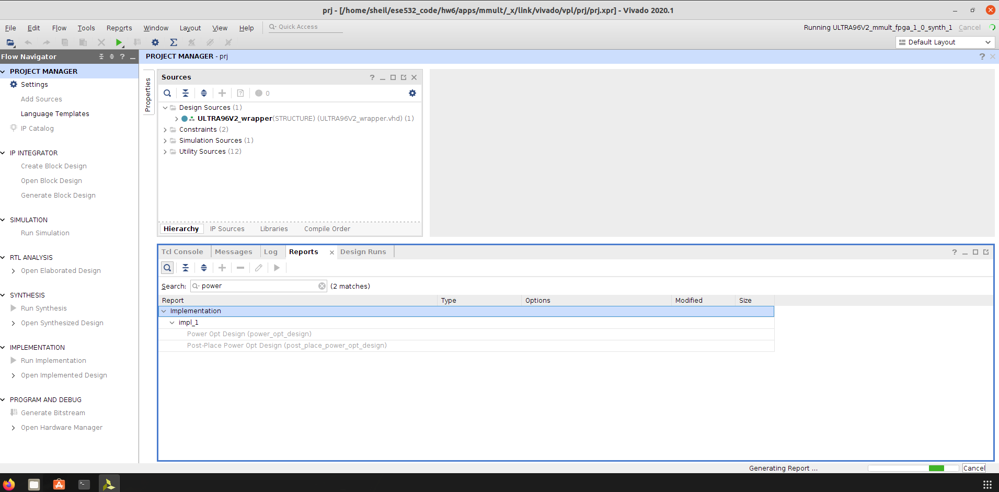

# ESE532 Homework 6 Submission 
## Sheil Sarda [sheils@seas]

1. **Accelerator Interface**
    1. Build and run the cpu version of Matrix Multiplication by doing `make cpu`. Report the latency.

    ```
    root@ultra96v2-2020-1:~# ./mmult_cpu
    Running 1x256 iterations of 32x32 floating point mmult...
    --------------- Key execution times ---------------
    Allocating arrays                :    0.366 ms
    Running mmult_cpu                :   11.561 ms
    Writing output to output_cpu.bin :    0.468 ms
    --------------- Total time ---------------
    Main program :   13.307 ms    
    ```
    2. 
        A. Build and run the initial FPGA version by doing `make fpga && make host`. Report the latency of the initial FPGA version.
        ```
        --------------- Key execution times ---------------
        OpenCL Initialization              :  239.494 ms
        Allocate contiguous OpenCL buffers :   17.084 ms
        Populating buffer inputs           :    0.316 ms
        Running kernel                     :   37.005 ms
        Writing output to output_fpga.bin  :    2.670 ms
        --------------- Total time ---------------
        Main program :  297.095 ms
        ``` 
        B. Give at least two reasons based on the console outputs, why you think the initial FPGA implementation has a higher latency than the software version.
        ## [TODO]
        
    1. You will now allocate contiguous host memories. Modify and build the `Host.cpp` code. Only build the host code by doing `make host` and copy it into the Ultra96 and run your modified code. Report the new latency.
    ```
    --------------- Key execution times ---------------
    OpenCL Initialization              :  542.213 ms
    Allocate contiguous OpenCL buffers :   24.504 ms
    Populating buffer inputs           :    0.315 ms
    Running kernel                     :  466.139 ms
    Writing output to output_fpga.bin  :    2.405 ms
    --------------- Total time ---------------
    Main program : 1035.862 ms
    ```
    4. Copy in the `xrt.ini` file into the Ultra96 and run the FPGA code again to get the Vitis Analyzer files. 
        
        A. Zoom in at the beginning and provide a screenshot.

        B. Based on the analyzer, suggest at least two ways of improving the performance of the FPGA code.

        - Register utilization is currently only 22%. If we were to implement pre-fetching for parts of the arrays required for computation, then we can eliminate the interleaved read calls made during the execution of the program.
        - Host write bandwidth utilization was 1.229%, leaving room to improve efficiency of host write transfers. To implement this, we can aggregate the data to be written in a single buffer and send it over PCIe to DDR.
    1. Our initial FPGA host code uses an in-order command queue. Find out [how to use an out-of-order command queue](https://xilinx.github.io/Vitis-Tutorials/master/docs/host-code-opt/README.html) to get overlap between communication and computation. Make the necessary change in the `Host.cpp`. 
        - Report the latency. 
        ```
        --------------- Key execution times ---------------
        OpenCL Initialization              :  466.249 ms
        Allocate contiguous OpenCL buffers :   25.003 ms
        Populating buffer inputs           :    0.323 ms
        Running kernel                     :  466.288 ms
        Writing output to output_fpga.bin  :    2.367 ms
        --------------- Total time ---------------
        Main program :  961.127 ms
        ```
        - Provide a screenshot from Vitis Analyzer.


    1. The code in `Host.cpp` preserve dependencies between computations in the out of order execution case by  implementing a load store queue and reordering operations which do not have true dependencies.

    1. Describe how the host processor communicates with the generated interface of the accelerator. 
        - As illustrated in the below image, Block-level interface protocols provide a mechanism for controlling the operation of the RTL module from other modules, and from software applications. 
        - Port-level interface protocols provide the same control over individual ports on the RTL module.
        
        - The below timing diagram shows the behavior of the block-level handshake signals created by the ap_ctrl_hs I/O protocol for a non-pipelined design.
        - When the design is ready to accept new inputs, the ap_ready signal goes High.
        

    1. What needs to happen to the HLS code so that we can achieve task-level parallelism?
        
        We need to enable host-to-kernel dataflow in a manner which loads independent instructions into the kernel for each execution cycle, rather than waiting until
        the kernel has finished processing one set of data.
        
        This allows temporal parallelism, where different stages of the same kernel processes a different set of data from multiple clEnqueueTask commands, in a
        pipelined manner. 
        
    1. Modify the HLS code to enable host to kernel dataflow. Make sure to run C simulation and verify that your HLS code is functionally correct. Provide the code in your report.
    ```cpp
    #include "MMult.h"
    #include <hls_stream.h>

    /**
    *
    * Design principles to achieve II = 1
    * 1. Stream data into local RAM for inputs (multiple access required)
    * 2. Partition local RAMs into N/2 sub-arrays for fully parallel access
    * (dual-port read)
    * 3. Pipeline the dot-product loop, to fully unroll it
    * 4. Separate multiply-accumulate in inner loop to force two FP operators
    *
    */

    void read(  const float *arrayA, 
                const float *arrayB,
                hls::stream<float> &inA,
                hls::stream<float> &inB,
                unsigned int numInputs){

        for(unsigned int i = 0; i < numInputs; ++i){
            
            #pragma HLS PIPELINE
            inA.write(arrayA[i]);
            inB.write(arrayB[i]);
        }
    }


    void exec(  hls::stream<float> &inA,
                hls::stream<float> &inB,
                hls::stream<float> &outStream){
        
        float A_tmp[N][N];
        #pragma HLS array_partition variable=A_tmp block factor=16 dim=2
        
        float B_tmp[N][N];
        #pragma HLS array_partition variable=B_tmp block factor=16 dim=1

        for (int c = 0; c < CHUNKS; c++) {
            
            // inA to A_tmp
            int i = 0;
            int j = 0;
            for (int itr = 0; itr < N * N; ++itr) {
                
                if(j == N) { j = 0; ++i}
                
                A_tmp[i][j] = inA.read();
                ++j;
            }
            
            // inB to B_tmp
            i = 0;
            j = 0;
            for (int itr = 0; itr < N * N; ++itr) {
                
                if(j == N) { j = 0; ++i}
                
                B_tmp[i][j] = inB.read();
                ++j;
            }

            // multiply
            for(int i = 0; i < N; ++i){
                for(int j = 0; j < N; ++j){
                    
                    float res = 0;
                    
                    for(int k = 0; k < N; ++k)
                        res += A_tmp[i][k] * B_tmp[k][j];
                    
                    outStream.write(res);
                }
            }
        }
    }

    void write( hls::stream<float> &outStream,
                float *output,
                unsigned int numInputs){

        for(unsigned int i = 0; i < numInputs; i++)
            output[i] = outStream.read();
    }


    void mmult_fpga(float A[CHUNKS * N * N], float B[CHUNKS * N * N],
                    float C[CHUNKS * N * N]) {

        #pragma HLS INTERFACE m_axi port=A bundle=b0
        #pragma HLS INTERFACE m_axi port=B bundle=b1
        #pragma HLS INTERFACE m_axi port=C bundle=b2
        #pragma HLS INTERFACE ap_ctrl_chain port=return

        #pragma HLS DATAFLOW
        hls::stream<float> inA;
        hls::stream<float> inB;
        hls::stream<float> outStream;

        read(A, B, inA, inB, CHUNKS * N * N);
        exec(inA, inB, outStream);
        write(outStream, C, CHUNKS * N *N);
    }
    ```
    10. Rebuild the FPGA version by doing `make fpga`, copy the binaries and boot files, reboot and test. This will take about 30 minutes to build. Report the latency. Provide a screenshot of the relevant section of Application Trace from Vitis Analyzer.

        When running make kernel.xclbin or make fpga, the compilation process runs until it gets to the linking step, then quits with the following error. I searched through all the forums I could find online, as well as every single log in the _x directory to try and get more context about the problem, but was not able to resolve it.

        Simulation output throws 3 errors, none of which relate to Host.cpp or MMult.cpp
        ```
        ERROR: [HLS 207-3640] thread-local storage is not supported for the current target: /opt/Xilinx/Vivado/2020.1/tps/lnx64/gcc-6.2.0/lib/gcc/x86_64-pc-linux-gnu/6.2.0/../../../../include/c++/6.2.0/mutex:580:10
        ERROR: [HLS 207-3640] thread-local storage is not supported for the current target: /opt/Xilinx/Vivado/2020.1/tps/lnx64/gcc-6.2.0/lib/gcc/x86_64-pc-linux-gnu/6.2.0/../../../../include/c++/6.2.0/mutex:581:10
        ERROR: [HLS 207-2580] cannot use 'throw' with exceptions disabled: Downloads/Utilities.h:65:9
        ```
        Build log
        ```
        [01:24:19] Starting bitstream generation..
        [01:25:22] Creating bitmap...
        [01:25:22] Writing bitstream ./ULTRA96V2_wrapper.bit...
        [01:25:22] Finished 6th of 6 tasks (FPGA bitstream generation). Elapsed time: 00h 01m 02s 
        [01:25:25] Run vpl: Step impl: Completed
        [01:25:26] Run vpl: FINISHED. Run Status: impl Complete!
        INFO: [v++ 60-1441] [01:25:27] Run run_link: Step vpl: Completed
        Time (s): cpu = 00:00:10 ; elapsed = 00:20:30 . Memory (MB): peak = 1329.320 ; gain = 0.000 ; free physical = 7075 ; free virtual = 14624
        INFO: [v++ 60-1443] [01:25:27] Run run_link: Step rtdgen: Started
        INFO: [v++ 60-1453] Command Line: rtdgen
        INFO: [v++ 60-1454] Run Directory: /mnt/castor/seas_home/s/sheils/ese532_code/hw6/apps/mmult/_x/link/run_link
        INFO: [v++ 60-1453] Command Line: cf2sw -a /mnt/castor/seas_home/s/sheils/ese532_code/hw6/apps/mmult/_x/link/int/address_map.xml -sdsl /mnt/castor/seas_home/s/sheils/ese532_code/hw6/apps/mmult/_x/link/int/sdsl.dat -xclbin /mnt/castor/seas_home/s/sheils/ese532_code/hw6/apps/mmult/_x/link/int/xclbin_orig.xml -rtd /mnt/castor/seas_home/s/sheils/ese532_code/hw6/apps/mmult/_x/link/int/kernel.rtd -o /mnt/castor/seas_home/s/sheils/ese532_code/hw6/apps/mmult/_x/link/int/kernel.xml
        INFO: [v++ 60-1652] Cf2sw returned exit code: 0
        INFO: [v++ 60-2311] HPISystemDiagram::writeSystemDiagramAfterRunningVivado, rtdInputFilePath: /mnt/castor/seas_home/s/sheils/ese532_code/hw6/apps/mmult/_x/link/int/kernel.rtd
        INFO: [v++ 60-2312] HPISystemDiagram::writeSystemDiagramAfterRunningVivado, systemDiagramOutputFilePath: /mnt/castor/seas_home/s/sheils/ese532_code/hw6/apps/mmult/_x/link/int/systemDiagramModelSlrBaseAddress.json
        INFO: [v++ 60-1618] Launching 
        INFO: [v++ 60-1441] [01:25:27] Run run_link: Step rtdgen: Completed
        Time (s): cpu = 00:00:00.59 ; elapsed = 00:00:00.71 . Memory (MB): peak = 1329.320 ; gain = 0.000 ; free physical = 7073 ; free virtual = 14621
        INFO: [v++ 60-1443] [01:25:27] Run run_link: Step xclbinutil: Started
        INFO: [v++ 60-1453] Command Line: xclbinutil --add-section DEBUG_IP_LAYOUT:JSON:/mnt/castor/seas_home/s/sheils/ese532_code/hw6/apps/mmult/_x/link/int/debug_ip_layout.rtd --add-section BITSTREAM:RAW:/mnt/castor/seas_home/s/sheils/ese532_code/hw6/apps/mmult/_x/link/int/system.bit --force --target hw --key-value SYS:dfx_enable:false --add-section :JSON:/mnt/castor/seas_home/s/sheils/ese532_code/hw6/apps/mmult/_x/link/int/kernel.rtd --add-section CLOCK_FREQ_TOPOLOGY:JSON:/mnt/castor/seas_home/s/sheils/ese532_code/hw6/apps/mmult/_x/link/int/kernel_xml.rtd --add-section BUILD_METADATA:JSON:/mnt/castor/seas_home/s/sheils/ese532_code/hw6/apps/mmult/_x/link/int/kernel_build.rtd --add-section EMBEDDED_METADATA:RAW:/mnt/castor/seas_home/s/sheils/ese532_code/hw6/apps/mmult/_x/link/int/kernel.xml --add-section SYSTEM_METADATA:RAW:/mnt/castor/seas_home/s/sheils/ese532_code/hw6/apps/mmult/_x/link/int/systemDiagramModelSlrBaseAddress.json --key-value SYS:PlatformVBNV:avnet.com_ULTRA96V2_ULTRA96V2_1_0 --output /mnt/castor/seas_home/s/sheils/ese532_code/hw6/apps/mmult/kernel.xclbin
        INFO: [v++ 60-1454] Run Directory: /mnt/castor/seas_home/s/sheils/ese532_code/hw6/apps/mmult/_x/link/run_link
        /mnt/pollux/software/xilinx/2020.1/Vitis/2020.1/bin/xclbinutil: line 49: /usr/bin/xclbinutil: No such file or directory
        INFO: [v++ 60-1442] [01:25:27] Run run_link: Step xclbinutil: Failed
        Time (s): cpu = 00:00:00.01 ; elapsed = 00:00:00.04 . Memory (MB): peak = 1329.320 ; gain = 0.000 ; free physical = 7073 ; free virtual = 14621
        ERROR: [v++ 60-661] v++ link run 'run_link' failed
        ERROR: [v++ 60-626] Kernel link failed to complete
        ERROR: [v++ 60-703] Failed to finish linking
        ```

        
    1. Report the clocks, memory ports and resources that are available on the platform:
        ```
        sheil@sheil-VM:~/vitis$ platforminfo $PLATFORM_REPO_PATHS/ese532_hw6_pfm.xpfm
        ==========================
        Basic Platform Information
        ==========================
        Platform:           ese532_hw6_pfm
        File:               /home/sheil/ese532_hw6_pfm/ese532_hw6_pfm.xpfm
        Description:        
        ese532_hw6_pfm
            

        =====================================
        Hardware Platform (Shell) Information
        =====================================
        Vendor:                           avnet.com
        Board:                            ULTRA96V2
        Name:                             ULTRA96V2
        Version:                          1.0
        Generated Version:                2020.1
        Software Emulation:               1
        Hardware Emulation:               0
        FPGA Family:                      zynquplus
        FPGA Device:                      xczu3eg
        Board Vendor:                     avnet.com
        Board Name:                       avnet.com:ultra96v2:1.1
        Board Part:                       xczu3eg-sbva484-1-i
        Maximum Number of Compute Units:  60

        =================
        Clock Information
        =================
        Default Clock Index: 0
        Clock Index:         0
            Frequency:         150.000000
        Clock Index:         1
            Frequency:         300.000000
        Clock Index:         2
            Frequency:         75.000000
        Clock Index:         3
            Frequency:         100.000000
        Clock Index:         4
            Frequency:         200.000000
        Clock Index:         5
            Frequency:         400.000000
        Clock Index:         6
            Frequency:         600.000000

        =====================
        Resource Availability
        =====================
        =====
        Total
        =====
            LUTs:  57915
            FFs:   126868
            BRAMs: 212
            DSPs:  360

        ==================
        Memory Information
        ==================
        Bus SP Tag: HP0
        Bus SP Tag: HP1
        Bus SP Tag: HP2
        Bus SP Tag: HP3
        Bus SP Tag: HPC0
        Bus SP Tag: HPC1
        =======================
        Feature ROM Information
        =======================

        =============================
        Software Platform Information
        =============================
        Number of Runtimes:            1
        Default System Configuration:  ese532_hw6_pfm
        System Configurations:
        System Config Name:                      ese532_hw6_pfm
        System Config Description:               ese532_hw6_pfm
        System Config Default Processor Group:   linux_domain
        System Config Default Boot Image:        standard
        System Config Is QEMU Supported:         0
        System Config Processor Groups:
            Processor Group Name:      linux on psu_cortexa53
            Processor Group CPU Type:  cortex-a53
            Processor Group OS Name:   linux
        System Config Boot Images:
            Boot Image Name:           standard
            Boot Image Type:           
            Boot Image BIF:            ese532_hw6_pfm/boot/linux.bif
            Boot Image Data:           ese532_hw6_pfm/linux_domain/image
            Boot Image Boot Mode:      sd
            Boot Image RootFileSystem: ese532_hw6_pfm/linux_domain/rootfs/rootfs.ext4
            Boot Image Mount Path:     /mnt
            Boot Image Read Me:        ese532_hw6_pfm/boot/generic.readme
            Boot Image QEMU Args:      
            Boot Image QEMU Boot:      
            Boot Image QEMU Dev Tree:  
        Supported Runtimes:
        Runtime: OpenCL
        ```
    1. Read about kernel and host code synchronization from [here](https://github.com/Xilinx/Vitis-Tutorials/blob/master/Runtime_and_System_Optimization/Design_Tutorials/01-host-code-opt/README.md#kernel-and-host-code-synchronization). Add a barrier synchronization to your host code. Only compile the host code, run it and provide a screenshot of the relevant section of vitis analyzer.
        
        **Note**: Compiling host using old kernel.xclbin because I ran into the aforementioned issue when using the compile_on_biglab script to make fpga for 2J
        
        Implemented in code as follows
        ```cpp
        // ---------
        // Step 3: Run the kernel
        // ---------

        timer2.add("Running kernel");
        
        int count = 0;
        
        for (int i = 0; i < NUM_TESTS; i++) {
            std::vector<cl::Event> write_events, exec_events, read_events;
            cl::Event write_ev, exec_ev, read_ev;

            krnl_mmult.setArg(0, A[i%NUM_MAT]);
            krnl_mmult.setArg(1, B[i%NUM_MAT]);
            krnl_mmult.setArg(2, C[i%NUM_MAT]);
            /* 0 means from host*/
            q.enqueueMigrateMemObjects({ A_buf, B_buf}, 0, NULL,
                                    &write_ev);
            write_events.push_back(write_ev);
            q.enqueueTask(krnl_mmult, &write_events, &exec_ev);

            exec_events.push_back(exec_ev);
            q.enqueueMigrateMemObjects({C_buf}, 
                    CL_MIGRATE_MEM_OBJECT_HOST, 
                    &exec_events, 
                    &read_ev);
            read_events.push_back(read_ev);
            
            count++;
            if(count == 3){
                count = 0;

                // 2L - Barrier synchronization
                clFinish(q.get());
            }
        }
        ```

        When compiling this new `Host.cpp` using the old `MMult.cpp`, after flashing to the SD card the program throws a `SEGFAULT`.
        ```sh
        root@ultra96v2-2020-1:/mnt/sd-mmcblk0p1# export XILINX_XRT=/usr
        root@ultra96v2-2020-1:/mnt/sd-mmcblk0p1# ./host kernel.xclbin
        Running 1x256 iterations of 32x32 task pipelined floating point mmult...
        INFO: Found Xilinx Platform
        INFO: Loading 'kernel.xclbin'
        Segmentation fault
        ```
    1. Assign separate ports to the `mmult_fpga` in `design.cfg`. 
        - Rebuild the FPGA version by doing `make fpga`, copy the binaries and boot files, reboot and test. This will take about 30 minutes to build. 

            Code provided to us on **Piazza**
            ```cfg
            platform=ese532_hw6_pfm
            debug=1
            profile_kernel=data:all:all:all
            save-temps=1

            [advanced]
            param=compiler.addOutputTypes=sd_card

            # Assign separate ports to the mmult_fpga in design.cfg. 
            [connectivity]
            nk=mmult_fpga:1:mmult_fpga_1
            sp=mmult_fpga_1.A:HP0
            sp=mmult_fpga_1.B:HP1
            sp=mmult_fpga_1.C:HP2
            ```

            Build Log
            
            The build errors out when calling `make fpga-j4` using `compile_on_biglab.sh`

            Tried calling `make clean` and rebuilding the kernel individually but ran into the same issue.
            ```sh
            ****** v++ v2020.1 (64-bit)
            **** SW Build 2902540 on Wed May 27 19:54:35 MDT 2020
                ** Copyright 1986-2020 Xilinx, Inc. All Rights Reserved.

            INFO: [v++ 60-1306] Additional information associated with this v++ link can be found at:
                    Reports: /mnt/castor/seas_home/s/sheils/ese532_code/hw6/apps/mmult/_x/reports/link
                    Log files: /mnt/castor/seas_home/s/sheils/ese532_code/hw6/apps/mmult/_x/logs/link
            INFO: [v++ 60-1657] Initializing dispatch client.
            Running Dispatch Server on port:35521
            INFO: [v++ 60-1548] Creating build summary session with primary output /mnt/castor/seas_home/s/sheils/ese532_code/hw6/apps/mmult/kernel.xclbin.link_summary, at Tue Nov  3 15:42:10 2020
            INFO: [v++ 60-1316] Initiating connection to rulecheck server, at Tue Nov  3 15:42:10 2020
            Running Rule Check Server on port:42087
            INFO: [v++ 60-1315] Creating rulecheck session with output '/mnt/castor/seas_home/s/sheils/ese532_code/hw6/apps/mmult/_x/reports/link/v++_link_kernel_guidance.html', at Tue Nov  3 15:42:11 2020
            INFO: [v++ 60-895]   Target platform: /mnt/castor/seas_home/s/sheils/ese532_code/ese532_hw6_pfm/ese532_hw6_pfm.xpfm
            INFO: [v++ 60-1578]   This platform contains Xilinx Shell Archive '/mnt/castor/seas_home/s/sheils/ese532_code/ese532_hw6_pfm/hw/ULTRA96V2.xsa'
            INFO: [v++ 60-629] Linking for hardware target
            INFO: [v++ 60-423]   Target device: ese532_hw6_pfm
            INFO: [v++ 60-1332] Run 'run_link' status: Not started
            INFO: [v++ 60-1443] [15:42:13] Run run_link: Step system_link: Started
            INFO: [v++ 60-1453] Command Line: system_link --xo /mnt/castor/seas_home/s/sheils/ese532_code/hw6/apps/mmult/kernel.xo -keep --config /mnt/castor/seas_home/s/sheils/ese532_code/hw6/apps/mmult/_x/link/int/syslinkConfig.ini --xpfm /mnt/castor/seas_home/s/sheils/ese532_code/ese532_hw6_pfm/ese532_hw6_pfm.xpfm --target hw --output_dir /mnt/castor/seas_home/s/sheils/ese532_code/hw6/apps/mmult/_x/link/int --temp_dir /mnt/castor/seas_home/s/sheils/ese532_code/hw6/apps/mmult/_x/link/sys_link
            INFO: [v++ 60-1454] Run Directory: /mnt/castor/seas_home/s/sheils/ese532_code/hw6/apps/mmult/_x/link/run_link
            INFO: [SYSTEM_LINK 60-1316] Initiating connection to rulecheck server, at Tue Nov  3 15:42:14 2020
            INFO: [SYSTEM_LINK 82-70] Extracting xo v3 file /mnt/castor/seas_home/s/sheils/ese532_code/hw6/apps/mmult/kernel.xo
            INFO: [SYSTEM_LINK 82-53] Creating IP database /mnt/castor/seas_home/s/sheils/ese532_code/hw6/apps/mmult/_x/link/sys_link/_sysl/.cdb/xd_ip_db.xml
            INFO: [SYSTEM_LINK 82-38] [15:42:15] build_xd_ip_db started: /mnt/pollux/software/xilinx/2020.1/Vitis/2020.1/bin/build_xd_ip_db -ip_search 0  -sds-pf /mnt/castor/seas_home/s/sheils/ese532_code/hw6/apps/mmult/_x/link/sys_link/ULTRA96V2.hpfm -clkid 0 -ip /mnt/castor/seas_home/s/sheils/ese532_code/hw6/apps/mmult/_x/link/sys_link/iprepo/xilinx_com_hls_mmult_fpga_1_0,mmult_fpga -o /mnt/castor/seas_home/s/sheils/ese532_code/hw6/apps/mmult/_x/link/sys_link/_sysl/.cdb/xd_ip_db.xml
            INFO: [SYSTEM_LINK 82-37] [15:42:18] build_xd_ip_db finished successfully
            Time (s): cpu = 00:00:02 ; elapsed = 00:00:03 . Memory (MB): peak = 1428.730 ; gain = 0.000 ; free physical = 17478 ; free virtual = 32086
            INFO: [SYSTEM_LINK 82-51] Create system connectivity graph
            INFO: [SYSTEM_LINK 82-102] Applying explicit connections to the system connectivity graph: /mnt/castor/seas_home/s/sheils/ese532_code/hw6/apps/mmult/_x/link/sys_link/cfgraph/cfgen_cfgraph.xml
            INFO: [SYSTEM_LINK 82-38] [15:42:18] cfgen started: /mnt/pollux/software/xilinx/2020.1/Vitis/2020.1/bin/cfgen  -nk mmult_fpga:1:mmult_fpga_1 -sp mmult_fpga_1.A:HP0 -sp mmult_fpga_1.B:HP1 -sp mmult_fpga_1.C:HP2 -dmclkid 0 -r /mnt/castor/seas_home/s/sheils/ese532_code/hw6/apps/mmult/_x/link/sys_link/_sysl/.cdb/xd_ip_db.xml -o /mnt/castor/seas_home/s/sheils/ese532_code/hw6/apps/mmult/_x/link/sys_link/cfgraph/cfgen_cfgraph.xml
            INFO: [CFGEN 83-0] Kernel Specs:
            INFO: [CFGEN 83-0]   kernel: mmult_fpga, num: 1  {mmult_fpga_1}
            INFO: [CFGEN 83-0] Port Specs:
            INFO: [CFGEN 83-0]   kernel: mmult_fpga_1, k_port: A, sptag: HP0
            INFO: [CFGEN 83-0]   kernel: mmult_fpga_1, k_port: B, sptag: HP1
            INFO: [CFGEN 83-0]   kernel: mmult_fpga_1, k_port: C, sptag: HP2
            INFO: [CFGEN 83-2228] Creating mapping for argument mmult_fpga_1.A to HP0 for directive mmult_fpga_1.A:HP0
            INFO: [CFGEN 83-2228] Creating mapping for argument mmult_fpga_1.B to HP1 for directive mmult_fpga_1.B:HP1
            INFO: [CFGEN 83-2228] Creating mapping for argument mmult_fpga_1.C to HP2 for directive mmult_fpga_1.C:HP2
            ERROR: [CFGEN 83-2229] Failed to find single interface to reach all segments in {HP0, HP1, HP2}
            ERROR: [SYSTEM_LINK 82-36] [15:42:18] cfgen failed
            Time (s): cpu = 00:00:00.13 ; elapsed = 00:00:00.24 . Memory (MB): peak = 1428.730 ; gain = 0.000 ; free physical = 17477 ; free virtual = 32086
            ERROR: [SYSTEM_LINK 82-62] Error generating design file for /mnt/castor/seas_home/s/sheils/ese532_code/hw6/apps/mmult/_x/link/sys_link/cfgraph/cfgen_cfgraph.xml, command: /mnt/pollux/software/xilinx/2020.1/Vitis/2020.1/bin/cfgen  -nk mmult_fpga:1:mmult_fpga_1 -sp mmult_fpga_1.A:HP0 -sp mmult_fpga_1.B:HP1 -sp mmult_fpga_1.C:HP2 -dmclkid 0 -r /mnt/castor/seas_home/s/sheils/ese532_code/hw6/apps/mmult/_x/link/sys_link/_sysl/.cdb/xd_ip_db.xml -o /mnt/castor/seas_home/s/sheils/ese532_code/hw6/apps/mmult/_x/link/sys_link/cfgraph/cfgen_cfgraph.xml
            ERROR: [SYSTEM_LINK 82-96] Error applying explicit connections to the system connectivity graph
            ERROR: [SYSTEM_LINK 82-79] Unable to create system connectivity graph
            INFO: [v++ 60-1442] [15:42:18] Run run_link: Step system_link: Failed
            Time (s): cpu = 00:00:04 ; elapsed = 00:00:06 . Memory (MB): peak = 1337.324 ; gain = 0.000 ; free physical = 17503 ; free virtual = 32112
            ERROR: [v++ 60-661] v++ link run 'run_link' failed
            ERROR: [v++ 60-626] Kernel link failed to complete
            ERROR: [v++ 60-703] Failed to finish linking
            INFO: [v++ 60-1653] Closing dispatch client.
            make: *** [Makefile:109: kernel.xclbin] Error 1

            ```
        - Report the latency. Provide a screenshot of the relevant section of Application Trace from Vitis Analyzer. 
            
            Could not complete this since the above `make fpga` command failed.
        - Does assigning multiple ports on Ultra96 have any impact on your design? 
            
            Yes. I hypothesize that assigning multiple ports on the Ultra96 would shift the bottleneck from IO to CPU / kernel.
            
    1. Use 2 `mmult_fpga` units. 
        - Rebuild the FPGA version by doing `make fpga`, copy the binaries and boot files, reboot and test. This will take about 30 minutes to build. 
            ```cfg
            platform=ese532_hw6_pfm
            debug=1
            profile_kernel=data:all:all:all
            save-temps=1

            [advanced]
            param=compiler.addOutputTypes=sd_card

            # Assign separate ports to the mmult_fpga in design.cfg. 
            [connectivity]
            nk=mmult_fpga:2:mmult_fpga_1
            sp=mmult_fpga_1.A:HP0
            sp=mmult_fpga_1.B:HP1
            sp=mmult_fpga_1.C:HP2
            ```

            Same issue as the previous part when trying to call `make fpga-j4` using `compile_on_biglab.sh`
        - Report the latency. 

            Unable to complete this because of `biglab` compile issues described above.
        - Provide a screenshot of the relevant section of Application Trace from Vitis Analyzer.

            Unable to complete this because of `biglab` compile issues described above.
    
1. **Analyze Implementation**

    In this question, we will investigate what the FPGA implementation of the matrix multiplication (1m) look like using Vivado (not Vivado HLS. Vivado is part of the Vitis installation.
            
    **Note**: I am using the `_x` formed when running the given `fpga` code due to all the compile issues mentioned above.

    1. Report how many resources of each type (BlockRAM, DSP unit,
    flip-flop, and LUT) the implementation (1m)
    consumes.  

        Vivado only gave me the option to select the utilization view.

        From the resource utilization view, I was only able to understand the utilization rate, as opposed to the number of resources used in the implementation.
        
        

    1. Report the expected power consumption of this design by clicking ***Report Power*** of the ***Implementation*** tab. (1 line)
        Vivado does not let me select this view when opening up my project.
        
    1.  - Open the ***Address Editor*** by choosing the corresponding tab above the block design.  
        Same issue as above
        - In which memory region is the control interface of the accelerator wrapper `mmult_fpga_1` mapped?  
        
            This region is used for such communication as starting the accelerator and querying its status.  Writes and reads by the ARM processor are to this region are sent over an AXI4-Lite bus to the accelerator wrapper, which handles them and controls the accelerator. (1 line)
    
    1. Open the timing report by going to the ***Implementation*** tab and pressing ***Design Timing Summary*** from the ***Timing*** tab.  Click on
            the number next to [Worst Negative Slack](http://www.vlsi-expert.com/2011/03/static-timing-analysis-sta-basic-timing.html).
  Look at the
            `Path Properties`.  Report in which of the hardware modules that we
            saw in the block design the path begins and ends. (1 line)
    1. Include a screenshot of the critical path in your writeup.
            Zoom in to make sure all elements of the path are clearly visible.
            Indicate the type of each element (e.g. LUT, flip-flop,
            carry chain) on the screenshot.
    1. Highlight the accelerators in green, the interconnect (`M_AXI` and `S_AXI`) in yellow.  You can do this by right-
            clicking the modules in the netlist view and selecting
            ***Highlight Leaf Cells***.  Include a screenshot of the entire
            device in your report.
    
        **Skipped the last  questions due to issues with Vivado not giving me the implementation path.**

        Also, Vivado crashed when trying to reload the project.
        ```
        Gtk-Message: 16:09:28.037: Failed to load module "canberra-gtk-module"
        /opt/Xilinx/Vivado/2020.1/bin/rdiArgs.sh: line 286:  3092 Killed                  "$RDI_PROG" "$@"
        ```

